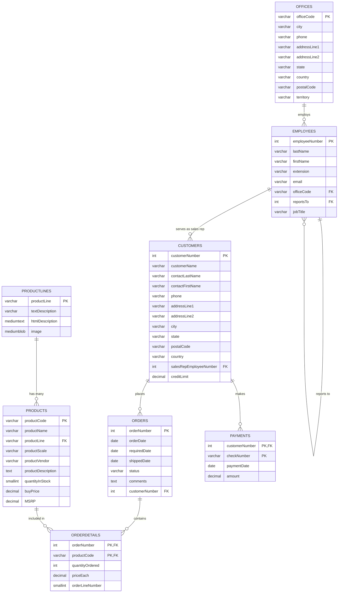

# Classic Models API

A comprehensive Django REST Framework API built on the Classic Models tutorial database, designed for demonstration and learning purposes.

## 🎯 Overview

This demo application showcases a complete REST API implementation using Django and Django REST Framework. Built on the Classic Models database, a well-known sample database used for learning SQL and database design.

### Key Features

- 🗄️ **MySQL Database** with Classic Models sample data
- 🚀 **Django REST Framework** API with full CRUD operations
- 🔐 **JWT Authentication** with user management
- 📚 **Interactive API Documentation** (Swagger/ReDoc)
- 📮 **Complete Postman Collection** with automated testing
- 🐳 **Docker & Docker Compose** for easy deployment
- 🧪 **Comprehensive Test Suite** with 100+ test cases
- 🛠️ **Makefile** for streamlined development workflow

## 🚀 Quick Start

### Prerequisites

- [Docker](https://docs.docker.com/get-docker/)
- [Docker Compose](https://docs.docker.com/compose/install/)
- [Make](https://www.gnu.org/software/make/) (optional but recommended)

### Setup & Run

1. **Clone and Start**
   ```bash
   git clone <repository-url>
   cd classic-models-api
   cp env.example .env
   make start
   ```

   The Docker setup will automatically:
   - Start MySQL database with sample data
   - Wait for database to be ready
   - Run Django migrations
   - Create demo user (username: `demo`, password: `demo123`)
   - Start the Django development server

2. **Access the API**
   - **API Documentation**: http://localhost:8000/classic-models/api/docs/
   - **ReDoc Documentation**: http://localhost:8000/classic-models/api/redoc/
   - **API Base URL**: http://localhost:8000/classic-models/api/v1/
   - **Postman Collection**: Import `Classic_Models_API.postman_collection.json`
   
   Note: The API is served at `/classic-models` base path for all environments.

### Demo Credentials

#### JWT Authentication
- **Username**: `demo`
- **Password**: `demo123`
- **Email**: `demo@classicmodels.com`

#### API Key Authentication
- **Demo API Key**: `GzIGzQD0pdtAi2LvYZCvJDhZZH2w87AaPZI_hFlF5BY`

The demo API key provides full admin access and is pre-configured for immediate testing. Use it with the `X-API-Key` header:

```bash
curl -H "X-API-Key: GzIGzQD0pdtAi2LvYZCvJDhZZH2w87AaPZI_hFlF5BY" \
  http://localhost:8000/classic-models/api/v1/products/
```

## 🗄️ Database Structure

The Classic Models database represents a fictional company that sells classic car models. Here's the complete database schema:



## 📣 Domain Events

The API publishes what it did — a stock movement, an order, a payment — as
CloudEvents on Kafka, through a transactional outbox. Consumers depend on that
shape, so it is written down: **[docs/DOMAIN_EVENTS.md](docs/DOMAIN_EVENTS.md)**
carries the envelope, the six event types with their payloads, the ordering and
delivery guarantees, and how to operate the relay.

One contract change came with it: creating an order line now decrements stock
and **refuses** a line that exceeds what is on hand, rather than letting stock
go negative.

## 🔌 API Structure

### Authentication

The API supports two authentication methods:

#### 1. JWT (JSON Web Token) Authentication

Standard user authentication with JWT tokens:

```bash
# Login
POST /classic-models/api/auth/login/
{
  "username": "demo",
  "password": "demo123"
}

# Response
{
  "access": "eyJ0eXAiOiJKV1QiLCJhbGciOiJSUzI1NiIsImtpZCI6Ii4uLiJ9...",
  "refresh": "eyJ0eXAiOiJKV1QiLCJhbGciOiJSUzI1NiIsImtpZCI6Ii4uLiJ9...",
  "user": { ... }
}

# Use the access token in subsequent requests
curl -H "Authorization: Bearer YOUR_ACCESS_TOKEN" \
  http://localhost:8000/classic-models/api/v1/products/
```

Gateway-friendly validation endpoints:

- `GET /classic-models/api/auth/.well-known/jwks.json` (JWKS for RS256 validation)
- `GET /classic-models/api/auth/.well-known/openid-configuration` (minimal OIDC discovery)

##### RS256 keys in Docker Compose (local)

For RS256, place your keypair in the repo:

- `./secrets/jwt/jwt_private.pem`
- `./secrets/jwt/jwt_public.pem`

`docker-compose.yml` mounts these into the API container at:

- `/run/secrets/jwt_private.pem`
- `/run/secrets/jwt_public.pem`

Then set in your `.env`:

```bash
JWT_ISSUER=http://localhost:8000/classic-models
JWT_AUDIENCE=classic-models-api
JWT_PRIVATE_KEY_FILE=/run/secrets/jwt_private.pem
JWT_PUBLIC_KEY_FILE=/run/secrets/jwt_public.pem
```

Restart/recreate the container:

```bash
docker-compose up -d --force-recreate api
```

##### Verify RS256 signature with jwt.io

1. Login and copy the `access` token:

```bash
curl -s -X POST "http://localhost:8000/classic-models/api/auth/login/" \
  -H "Content-Type: application/json" \
  -d '{"username":"demo","password":"demo123"}'
```

2. Fetch the JWKS and use the matching public key on `jwt.io`:

- JWKS: `http://localhost:8000/classic-models/api/auth/.well-known/jwks.json`
- Algorithm: `RS256`

#### 2. API Key Authentication (System-Level Access)

For demo/testing purposes, you can use an API key for system-level access with full admin privileges:

```bash
# Set API_KEY in your environment
export API_KEY="your-secure-api-key"

# Use X-API-Key header in requests
curl -H "X-API-Key: your-secure-api-key" \
  http://localhost:8000/classic-models/api/v1/products/
```

**API Key Features:**
- ✅ Full admin access (read, write, delete)
- ✅ No user login required
- ✅ Works as alternative to JWT authentication
- ✅ Ideal for automated scripts and testing
- ⚠️ **Demo purposes only** - use with caution in production

**Generating a Secure API Key:**
```bash
python -c "import secrets; print(secrets.token_urlsafe(32))"
```

**Configuration:**
Add to your `.env` file:
```bash
API_KEY=your-secure-api-key-here
```

### API Endpoints

#### Public Endpoints (No Authentication Required)
- `GET /classic-models/api/docs/` - Swagger UI documentation
- `GET /classic-models/api/redoc/` - ReDoc documentation
- `GET /classic-models/api/schema/` - OpenAPI schema
- `POST /classic-models/api/auth/login/` - User login
- `POST /classic-models/api/auth/signup/` - User registration
- `POST /classic-models/api/auth/refresh/` - Token refresh
- `GET /classic-models/api/auth/.well-known/jwks.json` - JWKS (public key set)
- `GET /classic-models/api/auth/.well-known/openid-configuration` - OIDC discovery (minimal)

#### Protected Endpoints (JWT Required)
- `GET /classic-models/api/auth/me/` - Current user info
- `POST /classic-models/api/auth/logout/` - User logout

#### Classic Models Data Endpoints

| Resource | Endpoints | Description |
|----------|-----------|-------------|
| **Product Lines** | `/classic-models/api/v1/productlines/` | Product categories |
| **Products** | `/classic-models/api/v1/products/` | Product catalog |
| **Offices** | `/classic-models/api/v1/offices/` | Company offices |
| **Employees** | `/classic-models/api/v1/employees/` | Staff information |
| **Customers** | `/classic-models/api/v1/customers/` | Customer data |
| **Orders** | `/classic-models/api/v1/orders/` | Customer orders |
| **Payments** | `/classic-models/api/v1/payments/` | Payment records |
| **Order Details** | `/classic-models/api/v1/orderdetails/` | Order line items |

### Example API Usage

```bash
# 1. Login to get JWT token
curl -X POST http://localhost:8000/classic-models/api/auth/login/ \
  -H "Content-Type: application/json" \
  -d '{"username": "demo", "password": "demo123"}'

# 2. Use token to access protected endpoints
curl -X GET http://localhost:8000/classic-models/api/v1/products/ \
  -H "Authorization: Bearer YOUR_ACCESS_TOKEN"

# 3. Get specific product
curl -X GET http://localhost:8000/classic-models/api/v1/products/S10_1678/ \
  -H "Authorization: Bearer YOUR_ACCESS_TOKEN"

# 4. Create new product
curl -X POST http://localhost:8000/classic-models/api/v1/products/ \
  -H "Authorization: Bearer YOUR_ACCESS_TOKEN" \
  -H "Content-Type: application/json" \
  -d '{
    "productCode": "S99_9999",
    "productName": "Test Product",
    "productLine": "Classic Cars",
    "productScale": "1:10",
    "productVendor": "Test Vendor",
    "productDescription": "A test product",
    "quantityInStock": 100,
    "buyPrice": "50.00",
    "MSRP": "75.00"
  }'
```

## 📮 Postman Collection

For easy API testing and exploration, we've included a comprehensive Postman collection with all endpoints and sample data.

### Quick Start with Postman

1. **Import the Collection**
   - Import `Classic_Models_API.postman_collection.json` from the project root into Postman

2. **Import an Environment**
   
   Choose one of the pre-configured environments:
   
   - **Local Development**: `Classic_Models_API_Local.postman_environment.json`
     - Base URL: `http://localhost:8000/classic-models`
     - For testing with Docker Compose
   
   - **Production**: `Classic_Models_API_AWS.postman_environment.json`
     - Base URL: Configure with your production URL
     - For testing deployed environments
   
   Both environments use the `/classic-models` base path. Import your chosen environment file and select it from the environment dropdown.

3. **Authentication Flow**
   - Run "Register User" to create a new account (optional)
   - Run "Login User" to authenticate and get JWT tokens
   - Tokens are automatically saved to collection variables
   - All subsequent authenticated requests will automatically use the stored access token

### Authentication Configuration

The collection uses Bearer token authentication configured at the collection level:

- **Collection-level**: Bearer token with variable `{{access_token}}`
- **Automatic token extraction**: Login endpoint automatically saves `access` and `refresh` tokens
- **Token refresh**: Refresh endpoint automatically updates the access token
- **Request-level**: Protected endpoints inherit collection authentication; public endpoints are set to "noauth"

#### Endpoints Without Authentication
- API Documentation (`/api/docs/`, `/api/schema/`, `/api/redoc/`)
- Register User (`/api/auth/signup/`)
- Login User (`/api/auth/login/`)
- Refresh Token (`/api/auth/refresh/`)
- JWKS (`/api/auth/.well-known/jwks.json`)
- OIDC discovery (`/api/auth/.well-known/openid-configuration`)

#### Endpoints With Authentication (Inherit from Collection)
- Get Current User (`/api/auth/me/`)
- Logout User (`/api/auth/logout/`)
- All CRUD endpoints for Product Lines, Products, Offices, Employees, Customers, Orders, Order Details, and Payments

### Collection Features

- 🔐 **Complete Authentication Flow** - Login, signup, token refresh, logout with automatic token management
- 📦 **Full CRUD Operations** - All entities with Create, Read, Update, Delete
- 🎯 **Realistic Sample Data** - Proper field values matching model constraints
- 🔄 **Automatic Token Management** - JWT tokens are automatically extracted and stored in collection variables
- 📚 **Organized by Resource** - Logical grouping of related endpoints
- 🛠️ **Environment Variables** - Easy configuration for different environments
- 🧪 **Automated Testing** - Run full collection tests with `make postman-test`

### Collection Structure

```
Classic Models API
├── Authentication
│   ├── Register User (noauth)
│   ├── Login User (noauth, auto-extracts tokens)
│   ├── Refresh Token (noauth, auto-updates access token)
│   ├── Get Current User (inherits auth)
│   └── Logout User (inherits auth)
├── Product Lines (inherits auth)
│   └── [Complete CRUD operations]
├── Products (inherits auth)
│   └── [Complete CRUD operations including search]
├── Offices (inherits auth)
│   └── [Complete CRUD operations]
├── Employees (inherits auth)
│   └── [Complete CRUD operations]
├── Customers (inherits auth)
│   └── [Complete CRUD operations]
├── Orders (inherits auth)
│   └── [Complete CRUD operations]
├── Order Details (inherits auth)
│   └── [Complete CRUD operations]
├── Payments (inherits auth)
│   └── [Complete CRUD operations]
└── API Documentation (noauth)
    ├── OpenAPI Schema
    ├── Swagger UI
    └── ReDoc
```

## 🚀 Deployment

The API is served at the `/classic-models` base path in all environments for consistency.

### Deployment Options

- **Local Development**: See [Quick Start](#-quick-start) section above
- **Production Deployment**: See [`docs/DEPLOYMENT.md`](docs/DEPLOYMENT.md) for detailed instructions
- **QNAP NAS Deployment**: See [`docs/NAS_DEPLOYMENT.md`](docs/NAS_DEPLOYMENT.md) for NAS-specific setup
- **Release Management**: See [`docs/RELEASE_MANAGEMENT.md`](docs/RELEASE_MANAGEMENT.md) for versioning and releases

## 🛠️ Development

### Using Make Commands (Recommended)

The project includes a streamlined Makefile with essential commands:

```bash
# Show all available commands
make help

# Docker Development
make build             # Build Docker containers
make start             # Start containers (database resets to original data)
make stop              # Stop containers

# Testing
make test              # Run test suite
make postman-test      # Run Postman collection tests
make health-check      # Check API health

# Utilities
make clean             # Clean up test result files
```

## 🧪 Testing

The project includes a comprehensive test suite with 100+ test cases. For detailed testing documentation, see [tests/README.md](tests/README.md).

### Quick Test Commands

```bash
# Run all tests
make test

# Run Postman collection tests
make postman-test

# Check API health
make health-check
```

### Test Structure

- **Model Tests**: Field validation, relationships, constraints
- **API Tests**: CRUD operations, authentication, validation
- **Postman Tests**: End-to-end API workflows and integration testing
- **Health Checks**: API endpoint availability verification

## 🐛 Troubleshooting

### Common Issues

1. **Port Conflicts**
   ```bash
   # Check if ports are in use
   lsof -i :8000
   lsof -i :3306
   ```

2. **Service Issues**
   ```bash
   # Check service status
   docker-compose ps
   
   # View logs
   docker-compose logs
   
   # Restart services
   make stop && make start
   ```

3. **Test Failures**
   ```bash
   # Check API health
   make health-check
   
   # Run Postman tests
   make postman-test
   ```

## 📚 Additional Documentation

- **[`docs/DEPLOYMENT.md`](docs/DEPLOYMENT.md)** - Production deployment guide with reverse proxy configuration
- **[`docs/NAS_DEPLOYMENT.md`](docs/NAS_DEPLOYMENT.md)** - QNAP NAS deployment instructions
- **[`docs/RELEASE_MANAGEMENT.md`](docs/RELEASE_MANAGEMENT.md)** - Version management and release process
- **[`docs/RATE_LIMITING.md`](docs/RATE_LIMITING.md)** - Rate limiting configuration and best practices
- **[`docs/API_KEY_AUTHENTICATION.md`](docs/API_KEY_AUTHENTICATION.md)** - API key authentication docs
- **[`docs/APIC_DATAPOWER_JWT.md`](docs/APIC_DATAPOWER_JWT.md)** - API Connect/DataPower JWT integration notes
- **[tests/README.md](tests/README.md)** - Comprehensive testing documentation
- **[db/migrations/README.md](db/migrations/README.md)** - Database migration guide

## 🎓 Learning Resources

This demo application demonstrates:

- **Django REST Framework** best practices
- **JWT Authentication** implementation
- **Docker containerization**
- **Database design** with foreign keys
- **API documentation** with OpenAPI/Swagger
- **RESTful API design** principles
- **Comprehensive testing** strategies
- **Development workflow** with Make
- **Rate limiting** and API security

## 🤝 Contributing

This is a demo application for educational purposes. Feel free to fork and modify for your own learning!

### Development Workflow

1. Fork the repository
2. Create a feature branch
3. Make your changes
4. Run tests: `make test`
5. Submit a pull request

## 📄 License

This project is for educational and demonstration purposes.